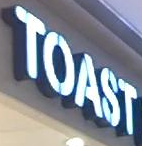

# Text-Recognition-from-PNG

## Getting Started
### Dependency
- This work was tested with PyTorch 1.3.1, CUDA 10.1, python 3.6 and Ubuntu 16.04. <br> You may need `pip3 install torch==1.3.1`. <br>
In the paper, expriments were performed with **PyTorch 0.4.1, CUDA 9.0**.
- requirements : lmdb, pillow, torchvision, nltk, natsort
```
pip3 install lmdb pillow torchvision nltk natsort
```

### Download lmdb dataset for traininig and evaluation from [here](https://www.dropbox.com/sh/i39abvnefllx2si/AAAbAYRvxzRp3cIE5HzqUw3ra?dl=0)
data_lmdb_release.zip contains below. <br>
training datasets : [MJSynth (MJ)](http://www.robots.ox.ac.uk/~vgg/data/text/)[1] and [SynthText (ST)](http://www.robots.ox.ac.uk/~vgg/data/scenetext/)[2] \
validation datasets : the union of the training sets [IC13](http://rrc.cvc.uab.es/?ch=2)[3], [IC15](http://rrc.cvc.uab.es/?ch=4)[4], [IIIT](http://cvit.iiit.ac.in/projects/SceneTextUnderstanding/IIIT5K.html)[5], and [SVT](http://www.iapr-tc11.org/mediawiki/index.php/The_Street_View_Text_Dataset)[6].\
evaluation datasets : benchmark evaluation datasets, consist of [IIIT](http://cvit.iiit.ac.in/projects/SceneTextUnderstanding/IIIT5K.html)[5], [SVT](http://www.iapr-tc11.org/mediawiki/index.php/The_Street_View_Text_Dataset)[6], [IC03](http://www.iapr-tc11.org/mediawiki/index.php/ICDAR_2003_Robust_Reading_Competitions)[7], [IC13](http://rrc.cvc.uab.es/?ch=2)[3], [IC15](http://rrc.cvc.uab.es/?ch=4)[4], [SVTP](http://openaccess.thecvf.com/content_iccv_2013/papers/Phan_Recognizing_Text_with_2013_ICCV_paper.pdf)[8], and [CUTE](http://cs-chan.com/downloads_CUTE80_dataset.html)[9].

### Run demo with pretrained model
1. Download pretrained model from [here](https://drive.google.com/drive/folders/15WPsuPJDCzhp2SvYZLRj8mAlT3zmoAMW)
2. Add image files to test into `Sample_images/`
3. Run demo.py (add `--sensitive` option if you use case-sensitive model)
```
CUDA_VISIBLE_DEVICES=0 python3 demo.py \
--Transformation TPS --FeatureExtraction ResNet --SequenceModeling BiLSTM --Prediction Attn \
--image_folder demo_image/ \
--saved_model TPS-ResNet-BiLSTM-Attn.pth
```

#### prediction results

| demo images | [TRBA (**T**PS-**R**esNet-**B**iLSTM-**A**ttn)](https://drive.google.com/open?id=1b59rXuGGmKne1AuHnkgDzoYgKeETNMv9) | [TRBA (case-sensitive version)](https://drive.google.com/open?id=1ajONZOgiG9pEYsQ-eBmgkVbMDuHgPCaY) |
| ---         |     ---      |          --- |
|     |   available   |  Available   |
|       |    shakeshack    |   SHARESHACK    |
|   |   london   |  Londen   |
|       |    greenstead    |   Greenstead    |
|     |   toast   |  TOAST   |
|       |    merry    |   MERRY    |
|     |   underground   |   underground  |
|       |    ronaldo    |    RONALDO   |
|     |   bally   |   BALLY  |
|       |    university    |   UNIVERSITY    |


### Training and evaluation
1. Train CRNN[10] model
```
CUDA_VISIBLE_DEVICES=0 python3 Train.py \
--train_data data_lmdb_release/training --valid_data data_lmdb_release/validation \
--select_data MJ-ST --batch_ratio 0.5-0.5 \
--Transformation None --FeatureExtraction VGG --SequenceModeling BiLSTM --Prediction CTC
```
2. Test CRNN[10] model. If you want to evaluate IC15-2077, check [data filtering part](https://github.com/clovaai/deep-text-recognition-benchmark/blob/c27abe6b4c681e2ee0784ad966602c056a0dd3b5/dataset.py#L148). 
```
CUDA_VISIBLE_DEVICES=0 python3 Test.py \
--eval_data data_lmdb_release/evaluation --benchmark_all_eval \
--Transformation None --FeatureExtraction VGG --SequenceModeling BiLSTM --Prediction CTC \
--saved_model saved_models/None-VGG-BiLSTM-CTC-Seed1111/best_accuracy.pth
```

3. Try to train and test our best accuracy model TRBA (**T**PS-**R**esNet-**B**iLSTM-**A**ttn) also. ([download pretrained model](https://drive.google.com/drive/folders/15WPsuPJDCzhp2SvYZLRj8mAlT3zmoAMW))
```
CUDA_VISIBLE_DEVICES=0 python3 Train.py \
--train_data data_lmdb_release/training --valid_data data_lmdb_release/validation \
--select_data MJ-ST --batch_ratio 0.5-0.5 \
--Transformation TPS --FeatureExtraction ResNet --SequenceModeling BiLSTM --Prediction Attn
```
```
CUDA_VISIBLE_DEVICES=0 python3 Test.py \
--eval_data data_lmdb_release/evaluation --benchmark_all_eval \
--Transformation TPS --FeatureExtraction ResNet --SequenceModeling BiLSTM --Prediction Attn \
--saved_model saved_models/TPS-ResNet-BiLSTM-Attn-Seed1111/best_accuracy.pth
```

### Arguments
* `--train_data`: folder path to training lmdb dataset.
* `--valid_data`: folder path to validation lmdb dataset.
* `--eval_data`: folder path to evaluation (with test.py) lmdb dataset.
* `--select_data`: select training data. default is MJ-ST, which means MJ and ST used as training data.
* `--batch_ratio`: assign ratio for each selected data in the batch. default is 0.5-0.5, which means 50% of the batch is filled with MJ and the other 50% of the batch is filled ST.
* `--data_filtering_off`: skip [data filtering](https://github.com/clovaai/deep-text-recognition-benchmark/blob/f2c54ae2a4cc787a0f5859e9fdd0e399812c76a3/dataset.py#L126-L146) when creating LmdbDataset. 
* `--Transformation`: select Transformation module [None | TPS].
* `--FeatureExtraction`: select FeatureExtraction module [VGG | RCNN | ResNet].
* `--SequenceModeling`: select SequenceModeling module [None | BiLSTM].
* `--Prediction`: select Prediction module [CTC | Attn].
* `--saved_model`: assign saved model to evaluation.
* `--benchmark_all_eval`: evaluate with 10 evaluation dataset versions, same with Table 1 in our paper.


## When you need to train on your own dataset or Non-Latin language datasets.
1. Create your own lmdb dataset.
```
pip3 install fire
python3 create_lmdb_dataset.py --inputPath data/ --gtFile data/gt.txt --outputPath result/
```
The structure of data folder as below.
```
data
├── gt.txt
└── test
    ├── word_1.png
    ├── word_2.png
    ├── word_3.png
    └── ...
```
At this time, `gt.txt` should be `{imagepath}\t{label}\n` <br>
For example
```
test/word_1.png Tiredness
test/word_2.png kills
test/word_3.png A
...
```
2. Modify `--select_data`, `--batch_ratio`, and `opt.character`, see [this issue](https://github.com/clovaai/deep-text-recognition-benchmark/issues/85).


## Acknowledgements
This implementation has been based on these repository [crnn.pytorch](https://github.com/meijieru/crnn.pytorch), [ocr_attention](https://github.com/marvis/ocr_attention).


## Links
- WebDemo : https://demo.ocr.clova.ai/ <br>
Combination of Clova AI detection and recognition, additional/advanced features used for KOR/JPN.
- Repo of detection : https://github.com/clovaai/CRAFT-pytorch


